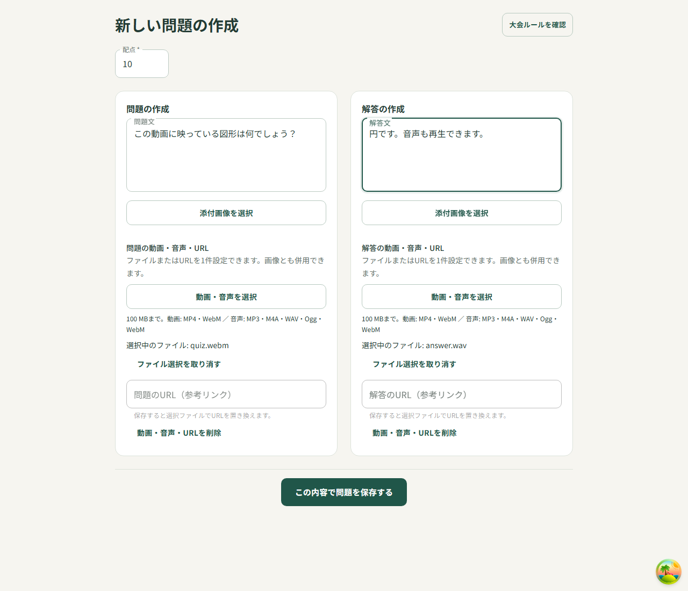
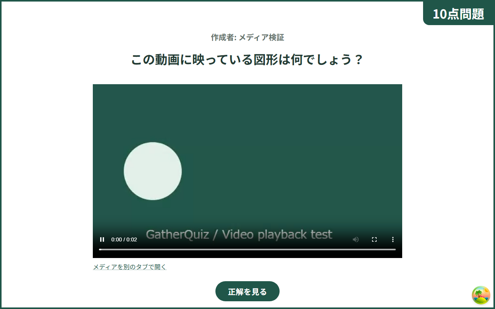
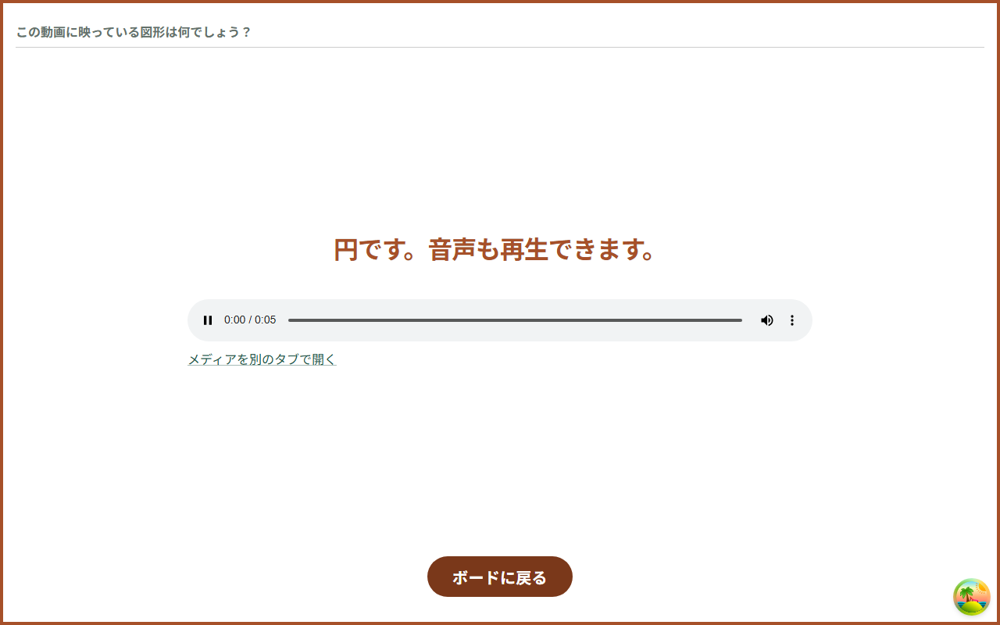
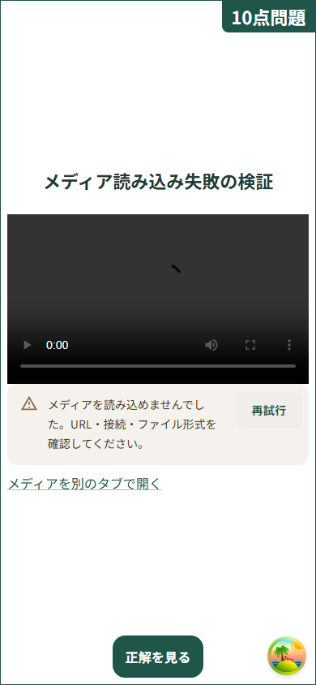
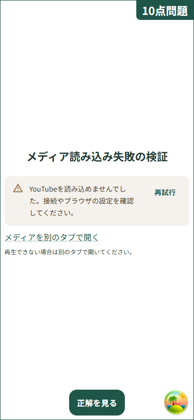
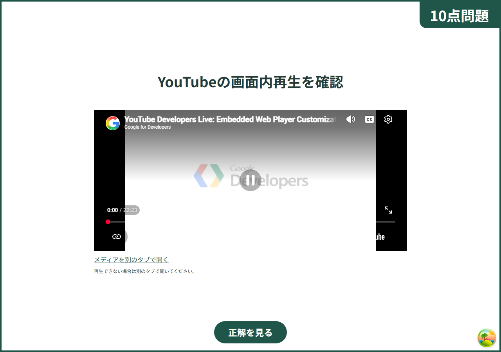

# 問題・解答のメディア対応 検証記録

検証日: 2026-09-08。ローカルのChromiumで撮影した実画面。

## 検証内容

- フロントエンド: 71テスト、lint、ビルド成功。
- バックエンド: 61テスト、lint、ビルド成功。
- Playwright E2E: 12テスト成功。新規ケースでは動画・音声添付、DB保存・再取得、プレビュー、本番再生、既読、編集、404・YouTube遮断、390px表示を検証。
- 動画はCanvasをMediaRecorderで録画したWebM、音声は生成したPCM WAV。両方の `currentTime > 0` を確認。
- E2EではS3署名発行とPUT/GETだけをローカル代替。問題保存・取得は本物のAPIと一時SQLite DBを使用。AWSデプロイ・本番S3転送は未実施。
- YouTube IFrame APIの正常・エラー・破棄イベントは単体テストで検証。実サービスでも公式デモ動画を埋め込み、再生ボタン操作後に `currentTime = 0.077455`、`paused = false`、`readyState = 4`、メディアエラーなしを確認。
- 無効URL、偽装YouTubeホスト、容量超過、空ファイル、非対応MIME、転送・保存失敗、再試行時の転送済みファイル保持、編集取得失敗、画像エラー、ロード・バッファ待ちタイムアウトも検証。
- Prismaスキーマ変更なし。一時テストDBの後処理と通常SQLite Clientへの復元を確認。

## 画面

### 作成画面

### 添付動画の再生

### 添付音声の再生

### モバイルでの取得失敗と再試行

### YouTube API遮断時

### YouTube実サービスの再生

## 再生成

PowerShellで `$env:CAPTURE_MEDIA_EVIDENCE = '1'; npm run test:e2e -- tests/quiz-media.spec.ts` を実行すると01〜05を更新できる。06はネットワーク依存の手動実サービス検証。

仕様参照: [YouTube公式IFrame API](https://developers.google.com/youtube/iframe_api_reference)。一般URLや未対応サービスは通常リンク、YouTubeと拡張子付きメディアURLは画面内再生。ブラウザで非対応のコーデックは再試行・外部リンクを案内する。S3実体の自動削除や変換は行わない。
