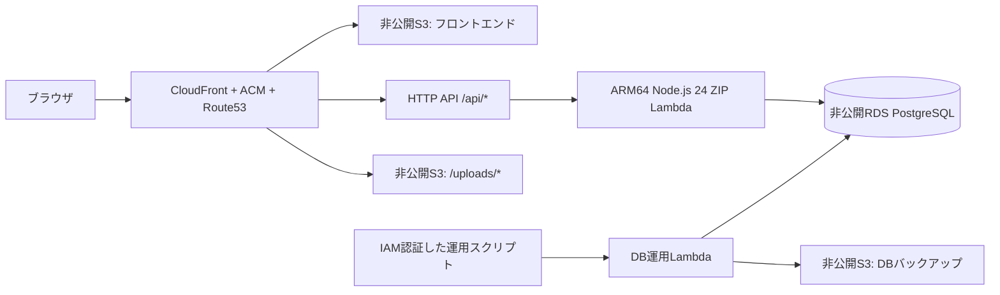

# インフラ運用

2026-09-09時点。CloudFormationと実リソースを正とする。検証結果は[デプロイ検証記録](デプロイ検証記録.md)を参照。

## 構成



- 東京リージョン。ACMのみCloudFrontの要件によりバージニア北部。
- Lambdaはesbuildで依存をまとめたZIP。Docker、ECR、コンテナビルドは不要。
- VPCは隔離サブネット2個、RDSはSingle-AZの`db.t4g.micro`、暗号化gp3 20GiB。パブリックアクセス無効。
- NAT Gateway、有料VPCエンドポイント、Provisioned Concurrencyは作成しない。S3への接続は無料のGateway Endpoint。
- API Lambdaは256MB、DB運用Lambdaは512MB・同時実行数1。アプリの接続プールは最大2。
- APIのDBユーザーは3テーブルのDML権限のみ。スキーマ作成と復元はIAM経由のDB運用Lambdaに限定する。
- DB接続は同梱RDS CAでTLS証明書を検証。パスワードはSSM Standard SecureStringに保存し、デプロイ時にLambda環境変数へ渡す。実行時のSSM取得は不要。
- CloudFrontからS3はOACでアクセス。`/api/*`はキャッシュ無効。SPAの既知ルートだけを`index.html`へ書き換える。
- HTMLは毎回再検証、ハッシュ付きアセットは1年キャッシュ。新しいアセットを先に、HTMLを最後に公開する。通常更新ではInvalidation不要。
- 旧アセットは開いている画面の互換性のため残す。長期運用で容量が増えた場合、参照期間を考慮して整理する。

## 初期構築・インフラ変更

Node.js 24、npm、AWS認証情報、既存のRoute53パブリックホストゾーンが必要。

```bash
npm ci
npm ci --prefix backend
npm ci --prefix frontend
npm run deploy
```

`scripts/config.ts`は`GATHER_ENV=dev`（既定）または`prod`を選択する。リージョンは`ap-northeast-1`。
devは`gather-quiz-dev` / `dev.gather-quiz.june-yamamoto.com`、prodは`gather-quiz-prod` / `gather-quiz.june-yamamoto.com`。
独自構成では`GATHER_STACK`、`AWS_REGION`、`GATHER_DOMAIN`、`GATHER_ZONE_ID`で上書きする。通常の環境切替では上書きしない。
CIの信頼先リポジトリは`cloudformation/ci.yaml`も確認する。

以下の4スタックを作成・更新する。

| スタック | 管理対象 |
| --- | --- |
| `gather-quiz-dev-artifacts` | ZIP格納S3 |
| `gather-quiz-dev-certificate` | ACM証明書（us-east-1） |
| `gather-quiz-dev` | アプリ、DB、ネットワーク、配信、DNS |
| `gather-quiz-dev-ci` | GitHub OIDCプロバイダーとデプロイロール |

prodのCIはdev CIの`OidcProviderArn`出力を共有する。独自構成は`GATHER_OIDC_PROVIDER_ARN`で指定できる。
プロバイダーを所有するdev CIスタックは本番の稼働中も維持する。
SSMのパスワードは初回のみ作成し、再デプロイで再生成しない。SSMはスタック外の運用スクリプトが管理する。

## 日常のデプロイ：GitHub Actionsから手動起動

1. PRのlint・単体テスト・ビルドが成功したことを確認し、mainへマージする。
2. GitHubのActions → **Deploy application** → **Run workflow**を開く。
3. ブランチは`main`、環境を`dev` / `prod`、対象を`backend` / `frontend` / `both`から選ぶ。

mainへのpushだけではAWSを更新しない。OIDCはmainからの実行だけを許可する。
GitHubリポジトリ変数`AWS_DEPLOY_ROLE_ARN`にdev CIの`DeploymentRoleArn`、`AWS_DEPLOY_PROD_ROLE_ARN`にprod CIの同出力を設定する。
長期AWSアクセスキーをGitHubに保存する必要はない。
手動ワークフローは通常のアプリ更新用で、インフラ変更は上の`npm run deploy`を権限のある環境から実行する。
Storybookの既存公開ワークフローは別用途として維持する。

## devのフロントエンド認証と本番の構築

devのHTML・JS・CSSなど、CloudFrontのデフォルト配信経路にはBasic認証を適用する。
CloudFront標準ドメインへの直接アクセスも対象。認証失敗は`401`と`Cache-Control: no-store`を返す。
API (`/api/*`) と投稿画像 (`/uploads/*`) は対象外で、既存のAPI認証・公開仕様を維持する。
本番はBasic認証なし。DB、バケット、Lambda、CloudFront、SSMはdevから分離し、devデータを移さない。

ユーザー名は`dev`。パスワードは東京リージョンのSSM Parameter Store `/gather-quiz-dev/frontend-password`（SecureString）に保管する。
IAM権限のある運用者がAWSコンソールで復号して確認する。Git・ログ・文書にはパスワードを載せない。
CloudFrontへは認証ヘッダーのSHA256のみを渡す。SSMの値は初回のみランダム生成し、再デプロイでも維持する。
ローテーション時はSSMの値を十分長いランダム値に更新後、以下の配信限定コマンドを実行する。

```powershell
# 既存devの配信関数のみ更新。DBとLambdaコードは更新しない。
$env:GATHER_ENV = 'dev'
node --import tsx scripts/frontend-access.ts
node --import tsx scripts/setup-ci.ts
npm run smoke -- --read-only

# 本番を初期構築、またはインフラ更新（DB初期化・移行を含む）
$env:GATHER_ENV = 'prod'
npm run deploy
npm run smoke -- --read-only
```

新規本番DBは現在のスキーマで初期化する。本番追加によりRDS等の環境ごとの費用が発生する。
`smoke --read-only`はdevのSSMを読み、未認証拒否と認証済み配信、本番の公開配信、API・DB接続を検証する。

バックエンドはZIPのSHA256が同じなら転送・Lambda更新を省略する。DB運用Lambda更新後にスキーマを確認してからAPIを更新する。
スキーマ確認が失敗した場合はDB運用Lambdaを前のZIPへ戻す。初期SQLとの差分は自動適用しない。
フロントエンドはS3メタデータのSHA256を比較し、差分だけアップロードする。
処理時間はActionsのログと7日保存のArtifactへ出力する。

## DBバックアップと復元

AWS認証を設定した作業環境から実行する。DBを外部公開したり、踏み台を作成する必要はない。

```bash
# S3キー、件数、チェックサムを出力（データ本文は出力しない）
npm run db:backup

# 出力されたキーを指定。隔離スキーマで復元し、検証後に削除
npm run db:verify -- backups/<出力されたファイル名>.json.gz

# 指定先DBの3テーブルを置き換える。事前に利用者の更新を止めて実行
npm run db:restore -- backups/<出力されたファイル名>.json.gz --confirm=gather-quiz-dev
```

- gzip JSON形式で`Tournament`、`Participant`、`Quiz`を同一トランザクションのスナップショットから保存する。
- DB運用Lambdaはバックアップの形式、初期SQLハッシュ、チェックサムを検証する。
- 復元はテーブルをロックし、現在の内容をS3へ退避してからトランザクション内で置き換える。失敗時はロールバックする。
- 圧縮後32MiB・展開後64MiBを上限とする小規模アプリ用。大量データへ拡張する場合はpg_dump等の別方式を追加する。
- このファイルはデータのみ。DBロール・DDL・画像は含まない。環境再作成はIaCと初期SQL、画像保護は画像S3のバージョニングを利用する。
- バックアップS3は暗号化・非公開、30日で期限切れ。長期保管が必要なら期限前に別の保護された場所へコピーする。
- RDSの自動バックアップは7日。DB削除保護を有効化し、スタック削除時はスナップショットを残す。
- パスワード等を含むため、バックアップ本文をログ・Git・PRへ載せない。

## スキーマ変更とロールバック

`backend/prisma/migrations/0001_initial/migration.sql`は実適用済みSQL。初回のみ実行し、適用済みハッシュを記録する。
既存DBのDDL変更には、将来の改修で明示的なバージョン付きマイグレーションを追加する。初期SQLの書き換えや本番への`db push`は使用しない。
アプリを戻す場合は、互換性を確認した変更をmainでrevertし、手動デプロイする。S3のZIPは30日保持する。
データを戻す場合は、上記の復元コマンドを使用する。

## 費用・運用上の判断

固定費を抑えるためRDSの小さいSingle-AZを採用した。TokyoのPostgreSQL `db.t4g.micro`は確認時点で時間単価0.025 USD、730時間なら計算資源だけで約18.25 USD/月。ストレージ・超過CPUクレジット・通信・リクエスト等は別料金。
Multi-AZの自動フェイルオーバーはなく、障害時の復旧時間とのトレードオフがある。
CloudWatchログは7日、ZIP・手動DBバックアップは30日、画像の旧バージョンは30日を基本にする。
削除時はRDS削除保護・Retain対象S3・SSM・証明書・DNSを確認し、必要なバックアップを確保してから明示的に削除する。

参考: [RDS料金](https://aws.amazon.com/rds/postgresql/pricing/)、[S3 Gateway Endpoint](https://docs.aws.amazon.com/vpc/latest/privatelink/vpc-endpoints-s3.html)、[CloudFrontのオブジェクト更新](https://docs.aws.amazon.com/AmazonCloudFront/latest/DeveloperGuide/UpdatingExistingObjects.html)。
# ラベル・選択問題のスキーマ追加

`0002_question_slots/migration.sql` は既存データを保持してTournament.questionSlotsとQuiz.label / choiceCount / choicesを追加する。初期SQLは変更しない。旧問題は通常問題・選択肢なしになる。

ZIPは `schema.current.sql`（現行構造の検証・新規DB用）、元の初期SQL、追加SQLを同梱する。運用Lambdaの明示的なmigrate操作は、既知の初期ハッシュの場合だけ追加SQLをトランザクション内で適用し、ハッシュを更新する。未知の構造は拒否する。通常APIから移行は実行しない。

本変更の導入時は、運用担当者の明示的な移行実行後に新APIを使用すること。旧スキーマのバックアップは新スキーマのrestoreでは拒否するため、移行前バックアップを保持し、移行後に新規バックアップとverifyを行う。今回の開発では実環境の移行・AWS操作・デプロイは行っていない。
